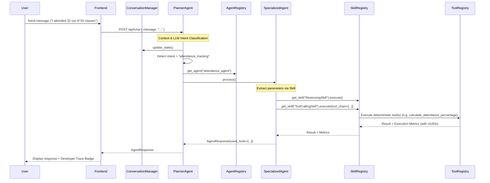

# CampusCopilot

CampusCopilot is an AI Student Success Agent that helps students manage studies, assignments, attendance, exams, resumes, and placements.

## Multi-Agent Architecture with Advanced Skills & Tools

CampusCopilot uses a central orchestrator pattern to route user intents to specialized agents. The system adheres to a rigorous **Tool Layer** and **Skill Registry** pattern, shifting all deterministic logic (math, database operations) out of the LLM and into reusable Python tools.

### Architecture Flow

### Agent Responsibilities

- **Planner Agent**: The main orchestrator. Receives all incoming chat messages, performs structured intent classification, maintains the ConversationManager, and delegates the task to the appropriate specialized agent via the Registry.
- **Study Agent**: Uses ReasoningSkill and ToolCallingSkill to generate study plans and revision schedules.
- **Attendance Agent**: Uses tools to calculate attendance percentages and predict shortages deterministically.
- **Assignment Agent**: Uses tools to calculate assignment priority scores based on urgency and importance.
- **Career Agent**: Uses tools for resume reviews, skill gap analysis, and placement preparation.
- **Memory Agent**: Wraps MemoryService in deterministic tools (store, recall, update, delete) to manage persistent user context.
- **General Agent**: A fallback agent to handle casual conversation and greetings.

### Tool Registry (`app/services/tools/`)

The centralized Tool Registry provides a robust, decoupled architecture for deterministic logic. Each tool exposes:
- `name`
- `description`
- `category` (e.g. Attendance, Assignment, Memory, Utility)
- `version`
- `requires_llm`
- `input_schema` & `output_schema`
- `execute()` (Python callable)

### Skill Registry (`app/services/skills/`)

Skills encapsulate reusable LLM or systemic behaviors that any agent can borrow:
- **ToolCallingSkill**: Interfaces with the Tool Registry, supports Tool Chaining, and automatically retries transient failures (using `tenacity` exponential backoff).
- **ReasoningSkill**: Wraps LLM for structured parameter extraction.
- **SummarizationSkill**: Wraps LLM for unstructured natural language generation.

## Modes of Operation

CampusCopilot ships with two distinct user interfaces:
1. **Production Mode (Default)**: A clean, ChatGPT-like interface focused entirely on delivering value. Internal agent routing, tool execution, and multi-agent coordination are completely abstracted away from the user.
2. **Developer Mode**: Toggled via the sidebar, this exposes a rich **Agent Execution Trace** under every message. It reveals exactly how the Planner routed the intent, the selected Agent, the Skills used, and the precise execution metrics (including success/failure and execution time) of every Tool.

## Folder Structure

- `backend/app/api`: FastAPI routes (e.g., `/chat` and Tool/Skill Discovery endpoints).
- `backend/app/core`: Configuration, database, and centralized Logger.
- `backend/app/services/agents`: The Planner orchestrator and specialized agents.
- `backend/app/services/context`: The Conversation Manager maintaining topic and history.
- `backend/app/services/skills`: The Skill Registry and reusable agent skills.
- `backend/app/services/tools`: The Tool Registry and deterministic tool implementations.
- `frontend/src`: React application featuring a premium dark-mode UI.

## Getting Started

1. Clone the repository and navigate to the project root.
2. Copy `backend/.env.example` to `backend/.env` and add your secrets (e.g., `GEMINI_API_KEY`).
3. Run `docker-compose up --build`.
4. Access the frontend at `http://localhost:5173`.
"# Campus__Copilot" 
